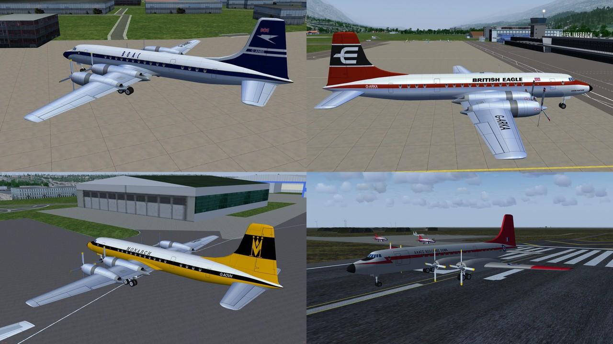
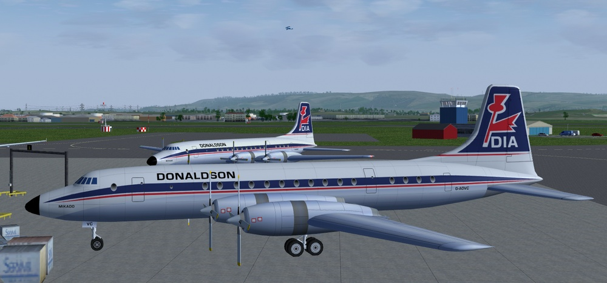
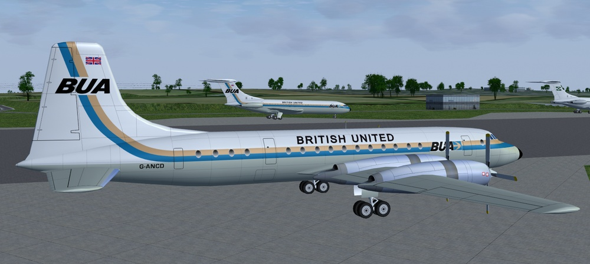
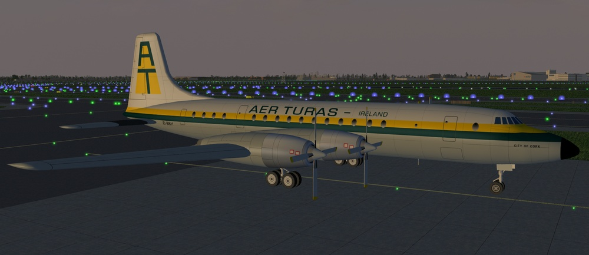
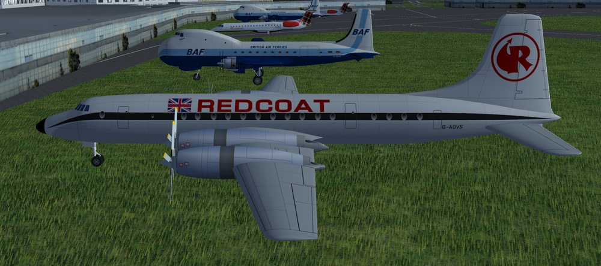

# Bristol Britannia
### AI Aircraft for FlightGear

G-ANBE BOAC ------  G-ARKA British Eagle

G-AOVH - Monarch ------  XX367 RAF Boscombe Down

G-AOVC - Donaldson

G-ANCD - BUA

EI-BBH - Aer Turas

G-AOVS - Redcoat

Download the zip file and extract the "Britannia" folder into the "$FG_ROOT/AI/Aircraft" folder.

To use you will need to create a traffic file, see the wiki for instructions.
 http://wiki.flightgear.org/AI_Traffic

A simple AI Traffic Creator (Python and a 64 bit windows) is available here: 
https://github.com/gooneybird47/FlightGear-AI-Traffic-Creator

I have included a few traffic files that are based on the actual routes flown but the times are not accurate. 
To use drop the "brit-traffic" folder into the "data\AI\Traffic\" folder.